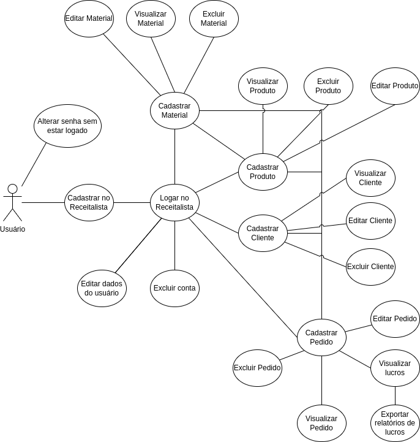

## Casos de Uso

| N°  | Caso de Uso | Requisito Funcional |
| :-: | :---------: | :-----------------: |
| 1 | Cadastrar no Receitalista | RF01 |
| 2 | Logar no Receitalista | RF04 |
| 3 | Editar dados do usuário | RF02, RF04 |
| 4 | Excluir conta |  RF03, RF04 |
| 5 | Cadastrar Material | RF10, RF04 |
| 6 | Editar Material | RF11, RF04 |
| 7 | Visualizar Material | RF10, RF13, RF14, RF04 |
| 8 | Excluir Material | RF10, RF12, RF04 |
| 9 | Cadastrar Produto | RF10, RF15, RF04 |
| 10 | Editar Produto | RF10, RF15, RF16, RF04 |
| 11 | Visualizar Produto | RF10, RF15, RF18, RF04 |
| 12 | Excluir Produto | RF10, RF15, RF17, RF04 |
| 13 | Cadastrar Cliente | RF05, RF04 |
| 14 | Editar Cliente | RF05, RF06, RF04 |
| 15 | Visualizar Cliente | RF05, RF08, RF09, RF04 |
| 16 | Excluir Cliente | RF05, RF04 |
| 17 | Cadastrar Pedido | RF20, RF05, RF10, RF15, RF04 |
| 18 | Editar Pedido | RF20, RF21, RF05, RF10, RF15, RF04 |
| 19 | Visualizar Pedido | RF20, RF23, RF05, RF10, RF15, RF04 |
| 20 | Excluir Pedido | RF20, RF22, RF05, RF10, RF15, RF04 |
| 21 | Visualizar lucros | RF20, RF25, RF04 |
| 22 | Exportar relatórios de lucros | RF20, RF25, RF04 |
| 23 | Alterar senha sem estar logado | RF02 |

### Diagrama de Casos de Uso 

- [Diagrama de Casos de Uso](https://drive.google.com/file/d/1ctAOOcyrGbv0_EMNVbEZUuqkaI3MKtAq/view?usp=sharing)

 

- 